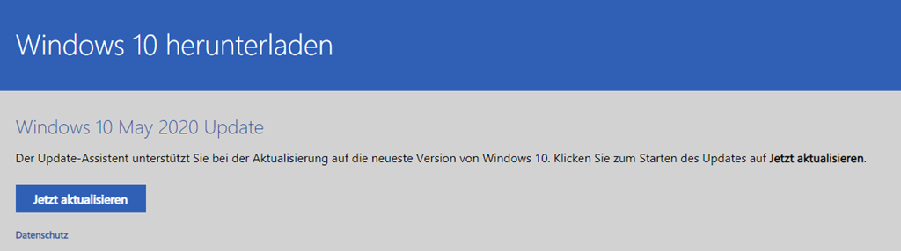
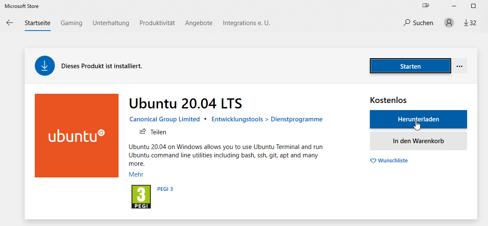
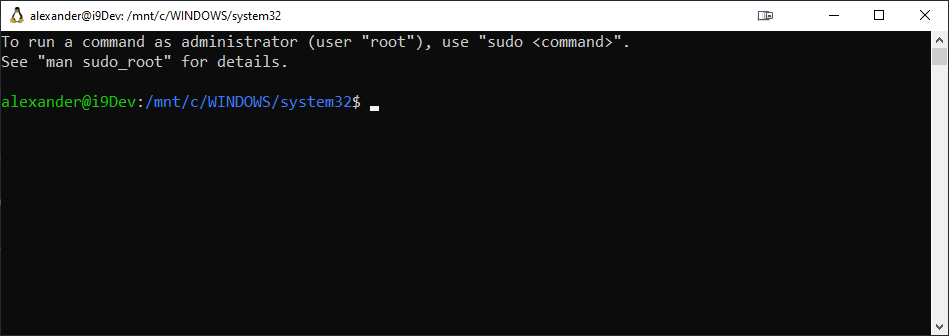
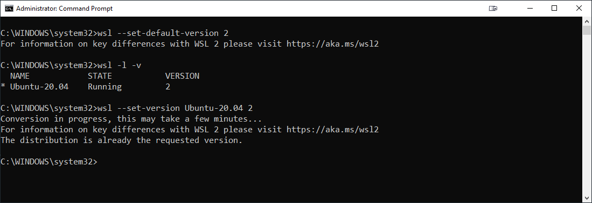

# Windows Subsystem Linux 2 (WSL2)

Requires Windows 10 - May 2020 Update or higher. To Update use this [link](https://www.microsoft.com/de-de/software-download/windows10).



Enable the Windows Subsystem for Linux:

```
Enable-WindowsOptionalFeature -Online -FeatureName Microsoft-Windows-Subsystem-Linux
```

Enable the Virtual Machine Platform feature:

```
Enable-WindowsOptionalFeature -Online -FeatureName VirtualMachinePlatform
```

Install Updated Linux-Kernel:

[Download the Linux Kernel Update Package](https://docs.microsoft.com/en-us/windows/wsl/wsl2-kernel)

Set WSL to Version 2:

```
wsl --set-default-version 2
```

Install a Linux Disto from Microsoft Store:



Set Username & Password:



Set WSL to use your default Disto

```
wsl -l -v
wsl --set-version DistroName 2
```



## Frameworks & Runtimes

### Node

Install Node Version Manager on WSL

```
sudo apt-get install curl 
curl -o- https://raw.githubusercontent.com/nvm-sh/nvm/v0.35.3/install.sh | bash 
```

### .NET Core 

```
curl https://packages.microsoft.com/keys/microsoft.asc | gpg --dearmor > microsoft.gpg
sudo mv microsoft.gpg /etc/apt/trusted.gpg.d/microsoft.gpg
sudo sh -c 'echo "deb [arch=amd64] https://packages.microsoft.com/repos/microsoft-ubuntu-bionic-prod bionic main" > /etc/apt/sources.list.d/dotnetdev.list'
```

```
sudo apt-get install apt-transport-https
sudo apt-get update
sudo apt-get install dotnet-sdk-3.1
```