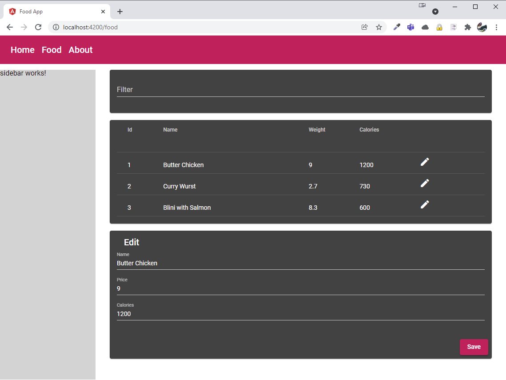

# Food App - UI

- Change to base layout in app.component to use [CSS Grid](https://css-tricks.com/snippets/css/complete-guide-grid/)
- Use a Material Design for Food App

- Implement a material.module and copy its default content from the Angular Docs
- Implement a custom material theme with a [custom color palette](https://material.io/resources/color/#!/?view.left=0&view.right=0)