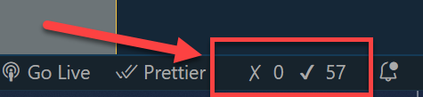

# Food App - Testing

Tools Setup:

- Install [Test Explorer UI](https://marketplace.visualstudio.com/items?itemName=hbenl.vscode-test-explorer)

```bash
code --install-extension hbenl/vscode-test-explorer
code --install-extension raagh.angular-karma-test-explorer
code --install-extension connorshea/vscode-test-explorer-status-bar
```

- Install [Wallaby.js](https://marketplace.visualstudio.com/items?itemName=WallabyJs.wallaby-vscode) and get your [trial licence](https://wallabyjs.com/download/) - (optional) 

```bash
code --install-extension wallabyjs.wallaby-vscode
```

- Get your [Wallaby-Trial-Key](https://wallabyjs.com/download/) and apply your Licence key press `F1 -> Wallaby.js: Manage Licence Key` and enter your key.

- Activate Wallaby using `F1 -> Wallaby.js: Start`

Notice the Wallaby indicator on the right bottom of Visual Studio Code



Testing:

> Note: Mock data is provided in `food.mocks.ts`

- Complete the pending tests in the following files:

    - food.service.spec.ts
    - navbar.component.spec.ts
    - food-list.component.spec.ts
    - food-edit.component.spec.ts
    - food-container.component.spec.ts

- Try to reach a [code coverage](https://angular.io/guide/testing-code-coverage) of more than 80%