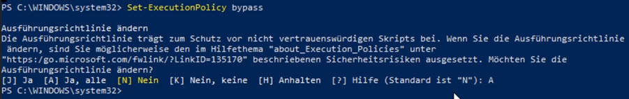

# Angular Introduction

[Angular Documentation](https://angular.io/docs)

[Frequently used Angular Modules](https://angular.io/guide/frequent-ngmodules)

[Angular Dev Tools](https://chrome.google.com/webstore/detail/angular-devtools/ienfalfjdbdpebioblfackkekamfmbnh)

## Extensions

[Angular Language Service](https://marketplace.visualstudio.com/items?itemName=Angular.ng-template)

[Angular 10 Snippets - TypeScript, Html, Angular Material, ngRx, RxJS & Flex Layout](https://marketplace.visualstudio.com/items?itemName=Mikael.Angular-BeastCode)

## Node Basics

[Node.js](https://nodejs.org)

[Node Version Manager for Windows - nvm](https://github.com/coreybutler/nvm-windows)

[WebPack](https://webpack.js.org/)

## Using Angular CLI

[Angular CLI Reference](https://angular.io/cli)

Install Angular CLI

```
npm i -g @angular/cli
```

>Note: Before using the Angular CLI for the first time on a Windows PC you might have to allow script execution in an elevated PowerShell prompt: `Set-ExecutionPolicy bypass`



Run an Angular project on a custom port

```
ng s -o --port 4300
```

Check creation of a new Demo using dry-run

```
ng g c demos/samples/mydemo -d
```

## Debugging in VS Code

Install [Debugger for Chrome Ext](https://marketplace.visualstudio.com/items?itemName=msjsdiag.debugger-for-chrome)

Edit `launch.json` in folder `.vscode` & make sure you execute `ng serve` bevor pressing F5 for debug

```json
{
  "version": "0.2.0",
  "configurations": [
    {
      "name": "ng serve",
      "type": "chrome",
      "request": "launch",
      "url": "http://localhost:4200/",
      "webRoot": "${workspaceFolder}"
    },
    {
      "name": "ng test",
      "type": "chrome",
      "request": "launch",
      "url": "http://localhost:9876/debug.html",
      "webRoot": "${workspaceFolder}"
    }
  ]
}
```

## Update Angular

```typescript
ng update @angular/cli [--allow-dirty] [@angular/material ...]
```
