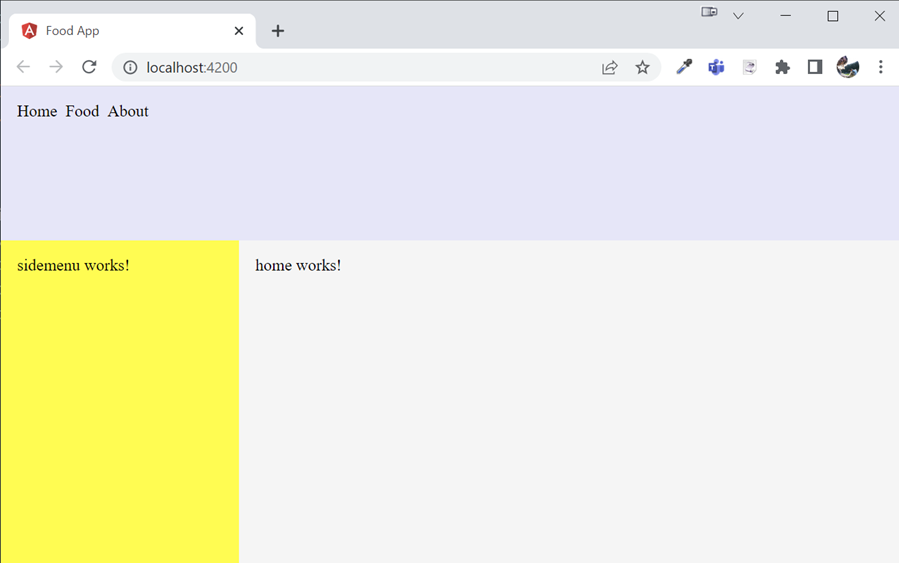
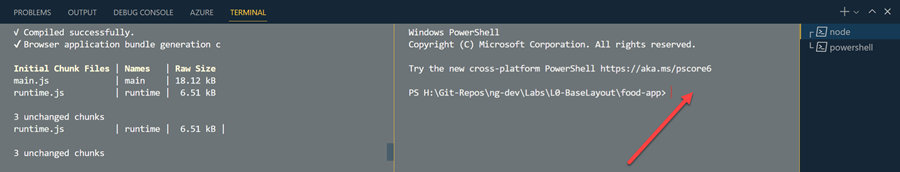

# Create a base Angular App with Layout

In this lab we will create a base Angular App with a layout and a navbar service.

Create the Angular app with the following layout containing the following components:

- home
- shared/sidemenu
- shared/navbar



It will load the menu items in the navbar using a navbar.service that takes its values from `assets/menu-items.json`:

```json
[
    {
        "title": "Home",
        "url": "/"
    },
    {
        "title": "Food",
        "url": "/food"
    },
    {
        "title": "About",
        "url": "/about"
    }
]
```

## Check the environment setup:

Make sure you have [Visual Studio Code](https://code.visualstudio.com/download), and a [compatible](https://angular.io/guide/versions) node version like [Node 18.17.1](https://nodejs.org/download/release/v18.17.1/) and the lasted [Angular CLI](https://angular.io/cli) installed:

```bash
node --version
ng version
```

Update to the current version of Angular CLI:

```
npm i -g @angular/cli
```

>Note: If you have problems execution scripts in PowerShell run: `Set-ExecutionPolicy bypass` in an elevated PowerShell Terminal. 

Also install the [Angular Language Service - Visual Studio Code extension](https://marketplace.visualstudio.com/items?itemName=Angular.ng-template).

## Step-by-Step Guide

Create Angular Project using the [Angular CLI](https://angular.io/cli/new):

```
ng new first-ng --routing --style scss 
cd food-app-l0
```

>Note: Add routing to the project as it will be used later on. Choose scss as your prefered style schematic. You could change this later on in `angular.json`:

```json
"@schematics/angular:component": {
          "style": "scss"
}
```

Delete the default content of `app.component.html` and start the dev server:

```
ng s -o
```

>Note: Typically dev server is running while you are working. You can split your terminal to execute other CLI commands



Add the components:

```
ng g c home
ng g c shared/sidemenu
ng g c shared/navbar
```

Notice the automatic declarations in `app.module.ts` because you have used Angular CLI: 

```typescript
@NgModule({
  declarations: [
    ...
    NavbarComponent,
    SidemenuComponent,
    HomeComponent
  ],
```

Import the css-reset from [http://meyerweb.com](https://meyerweb.com/eric/tools/css/reset/) to `styles.scss`

Add the following content to `app.component.html`:

```html
<div>
  <div class="navbar">
    <app-navbar></app-navbar>
  </div>
  <div class="mainrow">
    <div class="sidebar">
      <app-sidemenu></app-sidemenu>
    </div>
    <div class="main">
      <app-home></app-home>
    </div>
  </div>
</div>
```

Add the following styles to `app.component.scss`:

```css
.navbar{
  background-color: lavender;
  height: 150px
}

.sidebar{
  background-color: yellow;
  min-width: 200px;
  padding: 1rem;
}

.main{
  background-color: whitesmoke;
  width: calc(100vw - 200px);
  padding: 1rem;
}

.mainrow{
  display: flex;
  flex-direction: row;
  height: calc(100vh - 150px);
}
```

Add the menu service:

```
ng g s shared/navbar/navbar
```

In shared/navbar/ create a nav-item.model.ts and add the following content to it:

```typescript
export class NavItem {
  title = "";
  url = "";
}
```

Add `assets/menu-items.json`:

```json
[
    {
        "title": "Home",
        "url": "/"
    },
    {
        "title": "Food",
        "url": "/food"
    },
    {
        "title": "About",
        "url": "/about"
    }
]
```

Add `HttpClientModule` and `CommonModule` from [Frequently used Angular Modules](https://angular.io/guide/frequent-ngmodules) to `app.module.ts`:

```typescript
import { HttpClientModule } from "@angular/common/http";
...
 imports: [
    ...
    HttpClientModule
```

Inject Angular HttpClient in the constructor of `navbar.service.ts` and load `assets/menu-items.json`:

```typescript
export class NavbarService {
  http = inject(HttpClient);

  getItems() {
    return this.http.get<NavItem[]>("assets/menu-items.json");
  }
}
```

>Note: A copy of `menu-items.json` is located in the folder of this lab

Inject navbar.service in `navbar.component.ts` and get the menu items:

```typescript
export class NavbarComponent implements OnInit {
  ns = inject(NavbarService);
  navItems: NavItem[] = [];

  ngOnInit() {
    this.ns.getItems().subscribe((data) => {
      this.navItems = data;
    });
  }
}
```

Render the menu items in `navbar.component.html`:

```html
<div class="menu">
  <div class="menuItem" *ngFor="let item of navItems">{{ item.title }}</div>
</div>
```

Style `navbar.component.scss`:

```css
.menu{
    display: flex; 
    width: 100%;
    flex-direction: row;
    padding: 1rem;
}

.menuItem{
    margin-right: 0.5rem;    
    &:hover{
        text-decoration: underline;
        cursor: pointer;
    }
}
```

>Note: In Angular 15 the default environment files where removed. If you want to use environment files you have to create them manually. See [https://angular.io/guide/build#configuring-application-environments](https://angular.io/guide/build#configuring-application-environments)