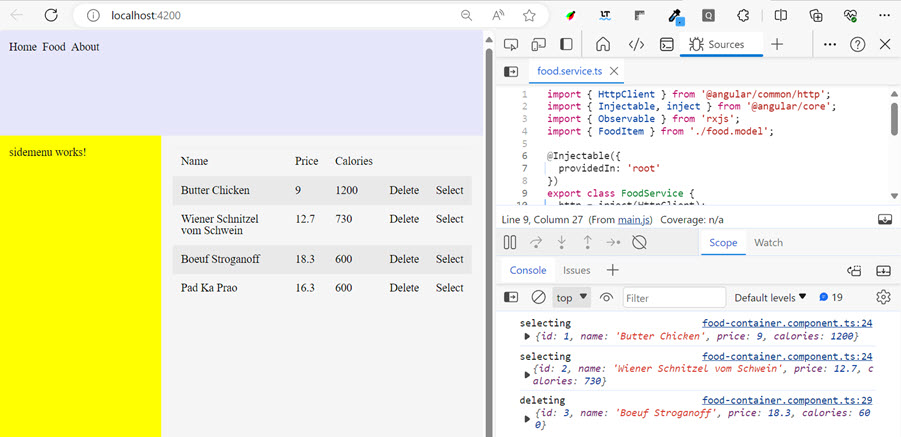

# Implement the Container / Presenter pattern

- In this lab we will implement a container / presenter pattern to manage food. 

  

  >Note: At the moment do not use Angular Material. Just put the `input`-tags into `div`-tags. 

## Steps Outlined

- Scaffold the components for the container / presenter pattern
- Implement the container component
- Implement the list component
- Implement the edit component

## Scaffold the components for the container / presenter pattern

- Food is a feature of this application. Therefore, create a folder `food` in the `app` folder to group all the artifacts related to food. Previously this was called a `feature module`. Modules are no longer used in standalone applications.

- Use the following nested components that you will create using the [Angular CLI](https://angular.io/cli/generate#component-command):

  - food/food-container -> container
  - food/food-list -> nested in container
  - food/food-edit -> nested in container

  Example:

  ```
  ng g component food/food-container
  ```

  >Note: Repeat the above command for `food-list` and `food-edit`

- Import food-container into app.component.ts:  

  ```typescript
  @Component({
    selector: 'app-root',
    standalone: true,
    imports: [
      ...
      FoodContainerComponent
    ],
    templateUrl: './app.component.html',
    styleUrl: './app.component.scss'
  })
  ```

- Replace `app-home` with `app-food-container` in `app.component.html`. Explicit routing to a `food-route` will be implemented in later modules. 

    ```html
    <div class="main">
        <app-food-container></app-food-container>
    </div>
    ```

- Add a `food.model.ts` file to folder `app/food`:

  ```typescript
  export class FoodItem {
    id = 0;
    name = "";
    price = 0;
    calories = 0;
  }
  ```

- Add food.json to the assets folder:

  ```json
  [
    { "id": 1, "name": "Butter Chicken", "price": 9, "calories": 1200 },
    { "id": 2, "name": "Wiener Schnitzel vom Schwein", "price": 12.7, "calories": 730 },
    { "id": 3, "name": "Boeuf Stroganoff", "price": 18.3, "calories": 600 },
    { "id": 4, "name": "Pad Ka Prao", "price": 16.3, "calories": 600 }
  ]
  ```

- Implement a `food/food-service.ts` using the client side model defined in `food.model.ts`:

  ```bash
  ng g service food/food
  ```

- Inject the [Angular HttpClient](https://angular.io/guide/http) client into `food/food-service.ts` and implement a `getFood()` method in food-service and load the data from `assets/food.json`. Take `navbar.service.ts` as a reference.  

## Implement the container component

- Implement a Container-Presenter Pattern in `food/food-container` using `food/food-list` and `food/food-edit`. Use the following reference: 

- [Container](/demos/03-fundamentals/fundamentals/src/app/demos/samples/container)

- [Presenter](/demos/03-fundamentals/fundamentals/src/app/demos/samples/persons)

  >Note: You can complete the container component on your own or use the following code as a reference

- Add the following code to `food-container.component.ts`. It imports the two presenter components and injects the `FoodService`. It also provides a selected item and a list of items to the presenters. To load the data it uses a subscribe method to the `getFood()` method of the `FoodService`. 

  ```typescript
  @Component({
    selector: 'app-food-container',
    standalone: true,
    imports: [FoodListComponent, FoodEditComponent],
    templateUrl: './food-container.component.html',
    styleUrl: './food-container.component.scss'
  })
  export class FoodContainerComponent {
    fs = inject(FoodService);
    food: FoodItem[] = [];
    selected: FoodItem | null = null;

    ngOnInit() {
      this.fs.getFood().subscribe((data) => (this.food = data));
    }

    selectFood(food: FoodItem) {
      console.log('selecting', food);
    }

    deleteFood(food: FoodItem) {
      console.log('deleting', food);
    }
  ```  

## Implement the list component

  - Implement a list component in `food/food-list` that displays a list of food items. It should also have a `select` and `delete` button for each item.  

    >Note: You can complete the container component on your own or use the following code as a  reference

- Copy `table.scss` to the `theme` folder and reference it in `styles.scss`.

- Add the following html to `food-list.component.html` to display the list of food items.

  ```html
  <table class="table table-striped table-hover">
    <thead>
      <tr>
        <th>Name</th>
        <th>Price</th>
        <th>Calories</th>
        <th>&nbsp;</th>
        <th>&nbsp;</th>
      </tr>
    </thead>
    <tbody>
      @for (p of food; track p) {
        <tr>
          <td>{{ p.name }}</td>
          <td>{{ p.price }}</td>
          <td>{{ p.calories }}</td>
          <td><a (click)="deleteFood(p)">Delete</a></td>
          <td><a (click)="selectFood(p)">Select</a></td>
        </tr>
      }
    </tbody>
  </table>
  ```

- Add the following code to `food-list.component.ts` to implement the `selectFood` and `deleteFood` methods. It also emits the `foodSelected` and `foodDeleted` events.

  ```typescript
  @Component({
    selector: 'app-food-list',
    standalone: true,
    templateUrl: './food-list.component.html',
    styleUrl: './food-list.component.scss'
  })
  export class FoodListComponent {
    @Input({ required: true }) food: FoodItem[] = [];
    @Output() foodSelected = new EventEmitter<FoodItem>();
    @Output() foodDeleted = new EventEmitter<FoodItem>();

    selectFood(item: FoodItem) {
      this.foodSelected.emit(item);
    }

    deleteFood(item: FoodItem) {
      this.foodDeleted.emit(item);
    }
  }
  ```

- Add the following to food-container.component.html. It passes the `food` array to the list component and listens to the `foodSelected` and `foodDeleted` events, that we have to implement in the list component.

  ```html
  <app-food-list
    [food]="food"
    (foodSelected)="selectFood($event)"
    (foodDeleted)="deleteFood($event)"
  ></app-food-list>
  ```

- Now you should be able to test and debug the list component. 

  

## Implement the edit component  

- Implement a simple form to allow editing of a food item in `food/food-edit`. 

  >Note: You can complete the container component on your own or use the following code as a reference

- Update `selectFood(...)` in `food-container.component.ts` to set the selected item and pass it to the edit component. You will need to pass a copy to the selected item to the edit component. Otherwise the inner component will change the outer component's state.

  ```typescript
  selectFood(food: FoodItem) {
    this.selected = Object.assign({}, food);
  }
  ```

- Add an `@Input` to receive the selected item and an `@Output` to emit the save event in `food-edit.component.ts`. The `ngOnChanges` method is used to access the item when a new value is passed to the input.

  ```typescript
  {
    @Input({ required: true }) food: FoodItem = new FoodItem();
    @Output() onFoodSave: EventEmitter<FoodItem> = new EventEmitter<FoodItem>();

    ngOnChanges(changes: SimpleChanges): void {
      console.log("receiving data on input:", changes["food"]?.currentValue);
    }

    saveFood() {
      if (this.food) this.onFoodSave.emit(this.food);
    }
  }
  ```

- Add a simple implementation of an edit form to `food-edit.component.html`. It should display the selected item and have a save button. 

  ```html
  <div class="form">
    <div class="row">
      <label>Name</label>
      <input type="text" [(ngModel)]="food.name" />
    </div>
    <div class="row">
      <label>Price</label>
      <input type="number" [(ngModel)]="food.price" />
    </div>
    <div class="row">
      <label>Calories</label>
      <input type="number" [(ngModel)]="food.calories" />
    </div>
    <div class="row">
      <label>&nbsp;</label>
      <button (click)="saveFood()">Save</button>
    </div>
  </div>
  ```  

- Add some styles to `food-edit.component.scss` to make the form look nice. 

  ```scss
  .form{
      width: 100%;
  }

  .row{
      display: flex;
      flex-direction: row nowrap;
      justify-content: space-between;
      margin: 0.5rem;
  }

  label{
      margin-right: 2rem;
      width: 150px;
  }

  input{
      min-width: 400px;
      flex-grow: 1;
  }

  button{
      min-width: 200px
  }
  ```

- Add the following to `food-container.component.html` to pass the selected item to the edit component and listen to the `onFoodSave` event. 

  ```html
  @if(selected){
    <app-food-edit [food]="selected"></app-food-edit>
  }
  ```

- Use the following code to implement `foodSaved()` in the container and hide the edit form after an item has been saved.

  ```typescript
  foodSaved(item: FoodItem) {
    const clone = Object.assign([], this.food) as Array<FoodItem>;
    let idx = clone.findIndex((c) => c.id == item.id);
    if (idx > -1) {
      clone[idx] = item;
    } else {
      clone.push(item);
    }
    this.food = clone;
    this.selected = null;
  }
  ```

- Handle the `onFoodSave` event in `food-container.component.html` and pass the selected item to the `foodSaved` method. Note the `$event` allows you to access the emitted value.

  ```html
  <app-food-edit [food]="selected" (onFoodSave)="foodSaved($event)"></app-food-edit>
  ```