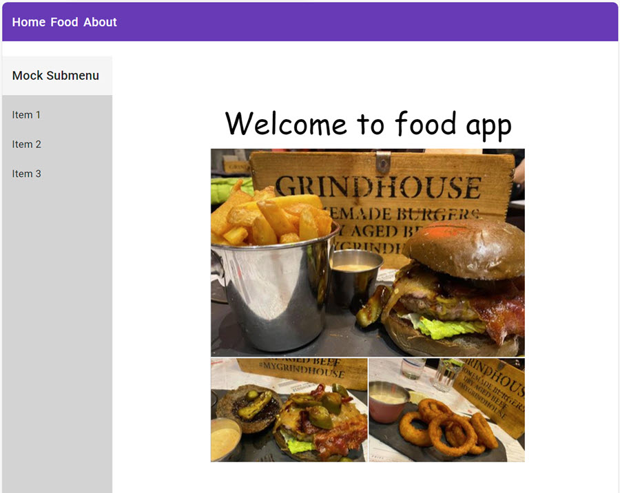

# Food App User Interface

In this lab we will use Angular Material to implement a user interface for the Food App. We will use the [Material Getting Started](https://material.angular.io/guide/getting-started) to install Angular Material and use the [Material Components](https://material.angular.io/components/categories) to implement the user interface. We will use [CSS Grid](https://css-tricks.com/snippets/css/complete-guide-grid/) to implement the base layout of the app.

We will also complete the implementation of the Food App by adding data access to the app.


## Steps Outlined

### Using Angular Material

Add [Angular Material](https://material.angular.io) to your project:

- Install Angular Material using the [Material Getting Started](https://material.angular.io/guide/getting-started) and choose a theme of your choice.

- Implement a `material.module.ts` and copy its default content from the [Demo App](/demos/05-ui/user-interface/src/app/material.module.ts).

- Test the installation of Angular Material by replacing the `div` in the `navbar.component.html` with a [Material Toolbar](https://material.angular.io/components/toolbar/overview)

Implement the Base Layout using CSS Grid:

- Change to base layout in app.component to use [CSS Grid](https://css-tricks.com/snippets/css/complete-guide-grid/). Use the [Demo App](/demos/05-ui/user-interface/src/app/app.component.html) Layout as a reference.
    
- Hide the sidebar on devices with a horizontal width less than medium. We will add a toggle button in another lab.

Implement a Material Design for Food App:

- Use [mat-card](https://material.angular.io/components/card/overview) elements in `food-list.component.html` and `food-edit.component.html` to surround the content

- Use [mat-table](https://material.angular.io/components/table/overview) for the `food-list.component.html`

    >Note: The material table receives its values from the following line:

    ```typescript
    @Input() food: FoodItem[] = [];
    ```
    When items in the table are updated, the ngOnChanges lifecycle hook is used to update the table:

    ```typescript
    ngOnChanges(changes: SimpleChanges) {
        this.dataSource = new MatTableDataSource(changes["food"].currentValue);
    }
    ```
- Use [mat-input](https://material.angular.io/components/form-field/overview) for `food-edit.component.html`

- Use the [mat-button-directive](https://material.angular.io/components/button/examples) for the `Save`-button in `food-edit.component.html`

### Load data from a REST API

# Food App Data Access

In this lab we will add data access to food-app. We will use [json-server](https://github.com/typicode/json-server) to provide a RESTful API for our food data. In real life you would use a backend service implemented in .NET or Spring to provide the data. 

## Steps Outlined

- Install [json-server](https://github.com/typicode/json-server):

    ```bash
    npm i -g json-server
    ```

- Create a database file for json-server (db.json) in the root of the starter project:

    ```json
    {
    "food": [
        { "id": 1, "name": "Butter Chicken", "price": 9, "calories": 1200 },
        { "id": 2, "name": "Curry Wurst", "price": 2.7, "calories": 730 },
        { "id": 3, "name": "Blini with Salmon", "price": 8.3, "calories": 600 }
    ]}
    ```

- Start json-server:

    ```bash
    json-server db.json
    ```

- Add food.service.ts, implement Create, Read, Update and Delete against the json-server api and use it in your app. Use the following [reference](/demos/05-ui/user-interface/src/app/skills/skills.service.ts)

    ```bash
    ng g s food/food
    ```

- If you want to generate and id for a new food item to be added, you could use this code fragment:

    ```typescript
    getNewId() {
        const nextId = this.food.reduce((acc, f) => (acc = acc > f.id ? acc : f.id), 0) + 1;
        return nextId;
    }
    ```

### Implement a custom Material Theme

Implement a custom material theme with a [custom color palette](https://material.io/resources/color/#!/?view.left=0&view.right=0) and replace the theme that you have chosen at the beginning of this lab:

- Use the [Demo App Theme](/demos/05-ui/user-interface/src/theme/mat-theme.scss) as a reference.

Add the `burger.png` file as a centered image to the `home.component.html` and use a custom [web font](https://fonts.google.com/) in the welcome text by registering it in `index.html`.


