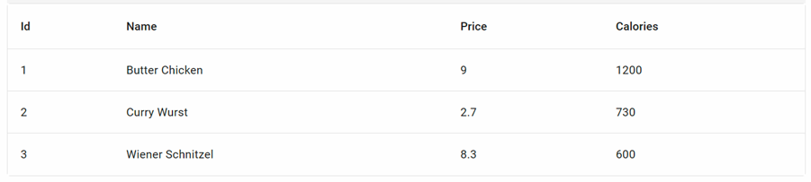
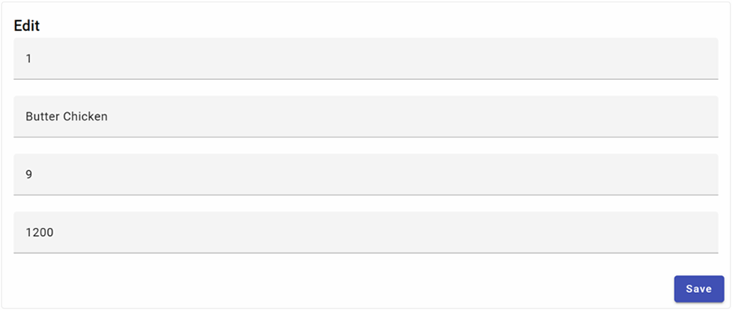

# Using @ngrx/signals in Angular Apps

In this lab we will solve the following tasks:

-   Take the `standalone app` from `lab-01` and setup a basic `SignalStore`
-   Re-build the classic Angular solution from `lab-02` to `lab-04`
-   Provide CRUD and loading for food using `@ngrx/signal`
-   Implement a `container presenter pattern`
-   Enhance our app by using `rxMethod` and persist data to the server

### Setup a basic Signal Store

-   Copy the `signals-starter` and install `@ngrx/signals`:

    ```bash
    npm i -S @ngrx/signals
    ```

-   Add a `food/food.model.ts` to the project. You could copy this file from a previous lab:

    ```typescript
    export class FoodItem {
        id = 0;
        name = '';
        price = 0;
        calories = 0;
    }
    ```

-   Add a `food/food.service.ts` to the project. You could copy this file from a previous lab:

    ```typescript
    @Injectable({
        providedIn: 'root',
    })
    export class FoodService {
        http = inject(HttpClient);

        getFood() {
            return this.http.get<FoodItem[]>(`${environment.api}/food`);
        }

        addFood(food: FoodItem) {
            return this.http.post<FoodItem>(`${environment.api}/food`, food);
        }

        updateFood(food: FoodItem) {
            return this.http.put<FoodItem>(`${environment.api}/food/${food.id}`, food);
        }

        deleteFood(id: number) {
            return this.http.delete<FoodItem>(`${environment.api}/food/${id}`);
        }
    }
    ```

-   Add a `food/store/food.store.ts` to implement the signal store:

    ```typescript
    type FoodState = {
        food: FoodItem[];
        selectedFood: FoodItem | null;
    }

    const initialState: FoodState = {
        food: [],
        selectedFood: null,
    }

    export const foodStore = signalStore(
        { providedIn: 'root' },
        withState(initialState),
    )
    ```

-   Add a `MatToolbar` to `food.component.ts` and inject the base store:

    ```typescript
    @Component({
        selector: 'app-food',
        standalone: true,
        imports: [MatToolbarModule],
        templateUrl: './food.component.html',
        styleUrl: './food.component.scss'
    })
    export class FoodComponent {
        readonly store = inject(foodStore)
    }
    ```

-   Place the `MatToolbar` in the template and show the food count:

    ```html
    <mat-toolbar>
        <mat-toolbar-row>
            Items in foodStore: {{ store.food.length }}
        </mat-toolbar-row>
    </mat-toolbar>
    ```

-   Test your work by running the app with `ng s -o`

### Provide CRUD and loading for food using `@ngrx/signals Signal Store`

-   Next we will use withComputed() to expose count as a store property. To do so update food.store.ts. To not forget to update the corresponding html template:

    ```typescript
    withComputed((store) => ({
        count: computed(() => store.food().length),
    }))
    ```

-   Provide add, remove, update and select:

    ```typescript
    withMethods((store) => ({
        addFood: (food: FoodItem) => {
            const items = [...store.food(), food];
            patchState(store, { food: items })
        },
        removeFood: (id: number) => {
            const items = store.food().filter((f: FoodItem) => f.id !== id);
            patchState(store, { food: items })
        },
        updateFood: (food: FoodItem) => {
            const allItems = [...store.food()];
            const idx = allItems.findIndex((f: FoodItem) => f.id === food.id);
            allItems[idx] = food;
            patchState(store, { food: allItems })
        },
        selectFood: (id: number) => {
            const item = store.food().find((f: FoodItem) => f.id === id);
            patchState(store, { selectedFood: item })
        },
        clearSelected() {
            patchState(store, { selectedFood: null })
        }
    })),
    ```

    > Note: With the current implementation we are not persisting the changes to the server.

-   In order to be able to load the initial item from the server, we will need to modify `food.store.ts` and it's withMethods section and add a `loadFood()` method:

    ```typescript
    withMethods((store, service = inject(FoodService)) => ({
        ...
        loadFood: () => {
            service.getFood().subscribe((food) => {
                patchState(store, { food })
            })
        },
    }))
    ```

    > Note: If we have set up @ngrx/data we could have used the `getAll()` method instead of `getFood()`.

-   To make sure that loadFood is called we will use withHooks() and call it in the `onInit()` hook:

    ```typescript
    withHooks({
        onInit({ loadFood }) {
            loadFood();
        },
    })
    ```

-   Just to check add the following to the template and run the app:

    ```html
    <div>
        @for (item of store.food(); track $index) {
            <div>
                {{item.name}}
            </div>
        }
    </div>
    ```

### Implement a container presenter pattern using signals and `input signals`

-   Next lets add a food-list and a food-edit component:

    ```typescript
    ng g c food/food-list
    ng g c food/food-edit
    ```

-   Food list should look like this. You can take the lab result from the previous module as a reference:

    

-   Add the following to the `food-list.component.ts`:

    ```typescript
    @Component({
        selector: 'app-food-list',
        standalone: true,
        imports: [MatTableModule, MatCardModule],
        templateUrl: './food-list.component.html',
        styleUrl: './food-list.component.scss'
    })
    export class FoodListComponent {
        @Input({ required: true }) food !: FoodItem[];
        @Output() onFoodSelected: EventEmitter<FoodItem> = new EventEmitter<FoodItem>();

        displayedColumns: string[] = ['id', 'name', 'price', 'calories'];
        dataSource: MatTableDataSource<FoodItem> = new MatTableDataSource<FoodItem>([]);

        ngOnChanges(changes: SimpleChanges) {
            if (changes['food']) {
            this.dataSource = new MatTableDataSource(changes['food'].currentValue);
            }
        }

        applyFilter(filterValue: string) {
            this.dataSource.filter = filterValue.trim().toLowerCase();
        }

        selectFood(p: FoodItem) {
            this.onFoodSelected.emit(p);
        }
    }
    ```

-   Add the following to the `food-list.component.html`:

    ```html
    <mat-card appearance="outlined">
        <table mat-table [dataSource]="dataSource">
            <ng-container matColumnDef="id">
                <th mat-header-cell *matHeaderCellDef>Id</th>
                <td mat-cell *matCellDef="let element">{{ element.id }}</td>
            </ng-container>

            <ng-container matColumnDef="name">
                <th mat-header-cell *matHeaderCellDef>Name</th>
                <td mat-cell *matCellDef="let element">{{ element.name }}</td>
            </ng-container>

            <ng-container matColumnDef="price">
                <th mat-header-cell *matHeaderCellDef>Price</th>
                <td mat-cell *matCellDef="let element">{{ element.price }}</td>
            </ng-container>

            <ng-container matColumnDef="calories">
                <th mat-header-cell *matHeaderCellDef>Calories</th>
                <td mat-cell *matCellDef="let element">{{ element.calories }}</td>
            </ng-container>

            <tr mat-header-row *matHeaderRowDef="displayedColumns"></tr>
            <tr class="clickable" mat-row
                *matRowDef="let row; columns: displayedColumns"
                (click)="selectFood(row)"
            ></tr>
        </table>
    </mat-card>
    ```

-   Add the following to the `food-list.component.scss`:

    ```css
        mat-card {
        margin-bottom: 1rem;
    }

    table {
        width: 100%;
    }

    .clickable {
        cursor: pointer;
    }
    ```

-   Food edit should look like this. You can take the lab from the previous module as a reference:

    

-   Add the following to the `food-edit.component.ts`:

    ```typescript
    @Component({
        selector: 'app-food-edit',
        standalone: true,
        imports: [
            MatCardModule,
            MatInputModule,
            MatButtonModule,
            ReactiveFormsModule,
            ColumnDirective
        ],
        templateUrl: './food-edit.component.html',
        styleUrl: './food-edit.component.scss'
    })
        export class FoodEditComponent {
        fb = inject(FormBuilder)
        @Input({ required: true }) food: FoodItem | null = null;
        @Output() onFoodSaved: EventEmitter<FoodItem> = new EventEmitter<FoodItem>();

        foodForm: FormGroup = this.fb.group({
            id: [this.food?.id],
            name: [this.food?.name, [Validators.required, Validators.minLength(3)]],
            price: [this.food?.price, [Validators.required, Validators.min(1)]],
            calories: this.food?.calories,
        });

        ngOnChanges(changes: SimpleChanges): void {
            if (changes['food']) {
            this.foodForm.setValue(changes['food'].currentValue);
            }
        }

        saveForm(): void {
            this.onFoodSaved.emit(this.foodForm.value);
        }
    }
    ```

-   Add the following to the `food-edit.component.html`:

    ```html
    <mat-card appearance="outlined">
        <mat-card-header>
            <mat-card-title>Edit</mat-card-title>
        </mat-card-header>
        <mat-card-content>
            <form [formGroup]="foodForm" novalidate column>
                <mat-form-field>
                    <mat-label>Id</mat-label>
                    <input matInput type="number" formControlName="id" />
                </mat-form-field>
                <mat-form-field>
                    <mat-label>Name</mat-label>
                    <input matInput type="text" placeholder="Name" formControlName="name" />
                </mat-form-field>
                @if ( foodForm.controls['name'].touched &&
                foodForm.controls['name'].errors != undefined ) {
                    <mat-error> Name is required & must be more than 3 chars </mat-error>
                }
                <mat-form-field>
                    <mat-label>Price</mat-label>
                    <input
                    matInput
                    type="number"
                    placeholder="Price"
                    formControlName="price"
                    />
                </mat-form-field>
                @if ( foodForm.controls['price'].touched &&
                foodForm.controls['price'].errors != undefined ) {
                    <mat-error> Price must be greater than 1€ </mat-error>
                }
                <mat-form-field>
                    <mat-label>Calories</mat-label>
                    <input
                    matInput
                    type="number"
                    placeholder="Calories"
                    formControlName="calories"
                    />
                </mat-form-field>
            </form>
        </mat-card-content>
        <mat-card-actions align="end">
            <button mat-raised-button color="primary" (click)="saveForm()">Save</button>
        </mat-card-actions>
    </mat-card>
    ```

-   Last but not least we will hook the container / presenter pattern by replacing the temporary html in `food.component.html`:

    ```html
    <app-food-list  [food]="store.food()" (onFoodSelected)="selectFood($event)"></app-food-list>

    @if (store.selectedFood()!=null) {
        <app-food-edit [food]="store.selectedFood()" (onFoodSaved)="saveFood($event)" ></app-food-edit>
    }
    ```

-   Add the following css to `food.component.scss`:

    ```css
    .addRow{
        display: flex;
        flex-direction: row;
        justify-content: space-between;
    }
    ```

-   Add the following code to `food.component.ts`. This time you will have to add the imports by yourself:

    ```typescript
    export class FoodComponent {
        store = inject(foodStore)

        selectFood(item: FoodItem) {
            this.store.selectFood(item.id);
        }

        saveFood(item: FoodItem) {
            if (item.id) {
                    this.store.updateFood(item);
            } else {
                this.store.addFood(item);
            }
            this.store.clearSelected();
        }
    }
    ```

### Enhance our app by using `rxMethod` and persist data to the server

-   The loadFood() method works, but the pattern we used to solve it is not very elegant. We can do better by using rxMethod().

-   Extend the state with a loading flag. Do not forget to update the initial state:

    ```typescript
    type FoodState = {
        food: FoodItem[];
        selectedFood: FoodItem | null;
        loading: boolean;
    }
    ```

-   Add a Material Progress Bar to the template:

    ```html
    <div class="progress">
        @if (store.loading()) {
            <mat-progress-bar mode="indeterminate"></mat-progress-bar>
        }
    </div>
    ```

-   Add the following css to `food.component.scss`:

    ```css
    .progress{
        height: 1rem;
        display: flex;
        flex-direction: column;
        justify-content: center;
    }
    ```

-   Let's look at the current implementation of `loadFood()`. It works but it is not very elegant. We can do better by using `rxMethod()`.

    ```typescript
    loadFood: () => {
        patchState(store, { loading: true });
        service.getFood().subscribe((items) => {
            patchState(store, { food: items })
        })
    }
    ```

-   Execute `npm i -S @ngrx/operators`. The operators library provides some useful operators that are frequently used when managing state and side effects. It adds [tapResponse](https://ngrx.io/guide/operators/operators#tapresponse) which you will have to import and we will use in the next step.

-   Replace it with this implementation:

    ```typescript
    loadFood: rxMethod<void>(
        pipe(
            switchMap(() => {
                patchState(store, { loading: true });
                return service.getFood().pipe(
                    tapResponse({
                        next: (food) => patchState(store, { food }),
                        error: console.error,
                        finalize: () => patchState(store, { loading: false }),
                    })
                );
            })
        )
    ),
    ```

-   Implement a `logError` function:

    ```typescript
    const logError = (error: Error) => console.error("error: ", error);
    ```

-   In `food.store.ts` try to update the following methods and let the use `rxMethod` and `food.service.ts`. A possible solution will be provided in the next step:

    -   addFood()
    -   updateFood()
    -   removeFood()
        > Note: If you are using @ngrx/data you could also combine the data service with the signal store.

-   Update `addFood()`:

    ```typescript
    addFood: rxMethod<FoodItem>(
        pipe(
            switchMap((food: FoodItem) => {
                patchState(store, { loading: true });
                return service.addFood(food).pipe(
                    tapResponse({
                        next: (food) => {
                            const items = [...store.food(), food];
                            patchState(store, { food: items })
                        },
                        error: logError,
                        finalize: () => patchState(store, { loading: false }),
                    })
                );
            })
        )
    ),
    ```

-   Update `updateFood()`:

    ```typescript
    updateFood: rxMethod<FoodItem>(
        pipe(
            switchMap((food: FoodItem) => {
                patchState(store, { loading: true });
                return service.updateFood(food).pipe(
                    tapResponse({
                        next: (food) => {
                            const allItems = [...store.food()];
                            const idx = allItems.findIndex((f: FoodItem) => f.id === food.id);
                            allItems[idx] = food;
                            patchState(store, { food: allItems })
                        },
                        error: logError,
                        finalize: () => patchState(store, { loading: false }),
                    })
                );
            })
        )
    ),
    ```

-   Update `removeFood()`:

    ```typescript
    removeFood: rxMethod<number>(
        pipe(
            switchMap((id: number) => {
                patchState(store, { loading: true });
                return service.deleteFood(id).pipe(
                    tapResponse({
                        next: (food) => {
                            const items = store.food().filter((f: FoodItem) => f.id !== id);
                            patchState(store, { food: items })
                        },
                        error: logError,
                        finalize: () => patchState(store, { loading: false }),
                    })
                );
            })
        )
    ),
    ```

- Add the following standalone directive to the shared/formatting folder and use it for the subsequent steps:   

    ```typescript
    @Directive({
        selector: '[clickable]',
        standalone: true,
        host: { 'style': 'cursor:pointer;' },
    })
    export class ClickableDirective {}
    ```

- Implement `addFood()` on your own by using the following nextId() function. Update the id of the new item before saving:

    ```typescript
    nextId: computed(() => store.food().reduce((max, p) => p.id > max ? p.id : max, 0) + 1),
    ```    

- Implement `deleteFood()` on your own by adding a delete button and an edit button to the food list. Remove selectFood() from the row.

    ```html
    <ng-container matColumnDef="delete">
      <th mat-header-cell *matHeaderCellDef></th>
      <td mat-cell *matCellDef="let element" class="icon-cell">
        <a (click)="deleteFood(element)">
          <mat-icon class="mat-18" matTooltip="Delete">delete</mat-icon>
        </a>
      </td>
    </ng-container>
    ```