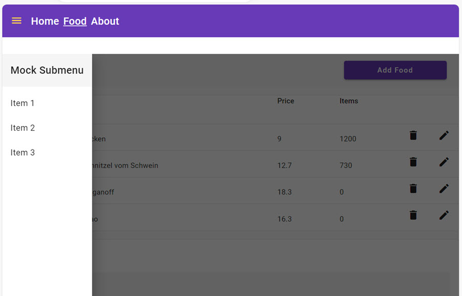

# Reactive Programming and State Management

In this lab we will implement a responsive `SideMenu` using `Signals` and `Stateful Services`. In order to achieve this we will use the [Angular Material Sidenav](https://material.angular.io/components/sidenav/overview). The Sidenav will be controlled by the [BreakpointObserver](https://material.angular.io/cdk/layout/overview) from the Material CDK.



## Steps Outlined

- Add a Signal based SideMenuService
- Implement a responsive Side Menu using Angular Material Sidenav
- Add client side state management using Signal based Stateful Services

### Add a Signal based SideMenuService

- Generate `sidemenu.service.ts` using Angular CLI

  ```bash
  ng g s shared/sidemenu/sidemenu 
  ```

- Use [sidenav.service.ts](/demos/07-reactive-state/reactive-state/src/app/shared/sidenav/sidenav.service.ts) as a reference to implement the `sidemenu.service.ts`. Do not copy past but basically it would work the same way. 

- Modify nav.component.html to use the SideMenuService

  ```html
  <mat-toolbar color="primary">
    <mat-toolbar-row>
      <div class="hamburgerMenu" (click)="toggleMenu()">
        <mat-icon color="accent">menu</mat-icon>
      </div>
  ```

- Add a required css to nav.component.scss

  ```css
  .hamburgerMenu{
    cursor: pointer;
    display: none;
    padding-top: 0.5rem;
    margin-right: 1rem;
  ;
    @media only screen and (max-width: 960px) {
      display: block;
    }
  }
  ```

- Next we will refactor the imperative code to get the `navItems` to a reactive approach using Signals. Remove the ngOnInit as we no longer need it.

  ```typescript
    ngOnInit() {
      this.nav.getItems().subscribe((data) => {
        this.navItems = data;
      });
    }
  ```

- Set navItems in a declarative way using the SideMenuService

  ```typescript
  nav = inject(NavbarService);
  navItems = this.nav.getItems();
  ```  

- Update the corresponding html to use the `navItems` Observable. You might need to import the `async` pipe from `@angular/common`.

  ```html
  @for (item of navItems | async; track item) {
    <div
      class="menuItem"
      routerLink="{{ '/' + item.url }}"
      routerLinkActive="navLinkActive"
      [routerLinkActiveOptions]="{ exact: true }"
    >
      {{ item.title }}
    </div>
    }
  ```

- Inject the SideMenuService to the `nav.component.ts` and implement the `toggleMenu` method.

  ```typescript
  export class NavbarComponent {
    sideMenu = inject(SideMenuService);
    nav = inject(NavbarService);
    navItems = this.nav.getItems()

    toggleMenu() {
      this.sideMenu.toggleMenuVisibility();
    }
  }
  ```

- Check the behavior in the browser

### Implement a responsive Side Menu using Angular Material Sidenav

- Replace the current html with a base layout for Material Sidenav in app.component.html    

  ```html
  <div class="grid">
    <div class="gd-navbar">
      <app-navbar></app-navbar></div>
    <div class="gd-loading">    
    </div>
    <div class="gd-mainrow">
      <mat-sidenav-container>
        <mat-sidenav #sidenav class="sidenav"
        [opened]="navVisible()" [mode]="navPosition()">
          <app-sidemenu></app-sidemenu>
        </mat-sidenav>
        <mat-sidenav-content [ngStyle]="workbenchMargin">
          <router-outlet></router-outlet>
        </mat-sidenav-content>
      </mat-sidenav-container>
    </div>
  </div>
  ``` 
- Add a required css to app.component.scss

  ```css
  .grid {
    display: grid;
    height: 100vh;
    width: 100%;
    gap: 0.5rem;
    grid-template-rows: 70px 10px calc(100vh - 100px);
    grid-template-columns: auto;
    grid-template-areas:
      "navbar"
      "loading"
      "mainrow";
  }

  .gd-navbar {
    grid-area: navbar;
  }

  .gd-loading {
    grid-area: loading;
  }

  .gd-mainrow {
    grid-area: mainrow;
    background-color: lightgray;
  }

  .sidenav{
    height: 80vh;
  }
  ```

- Update app.component.ts. It injects the SideMenuService and sets the navPosition and navVisible properties. It also sets the workbenchMargin property to adjust the margin of the workbench when the sidenav is visible. It uses the effect function to achieve this goal.

  ```typescript
  export class AppComponent {
    nav = inject(SideMenuService);
    title = environment.title;

    navPosition = this.nav.getSideNavPosition();
    navVisible = this.nav.getSideNavVisible();
    workbenchMargin = {};

    constructor() {
      effect(() => {
        this.workbenchMargin = this.navVisible() ? { 'margin-left': '0.5rem' } : {};
      })
    }
  }
  ```

- Last we will hook the hamburgerMenu to the SideMenuService. Modify the nav.component.ts to use the SideMenuService and add a navVisible property which will be a signal<boolean>. We will use this in our style binding to show/hide the hamburgerMenu.

  ```typescript
  export class NavbarComponent {
    ...
    sideMenu = inject(SideMenuService);
    navVisible = this.sideMenu.getSideNavVisible();
  }
  ``` 

### Add client side state management using Signal based Stateful Services

- Signals and Stateful Services are the tools we will use to manage client side state. In real world scenarios, you would typically use a state management library such as NgRx and [@ngrx/signals](https://ngrx.io/guide/signals). This topic is covered in more detail in the `Advanced Angular Development` course. In this lab, we will use Signals and Stateful Services to learn the basic principles of how state management libraries work.
 

 