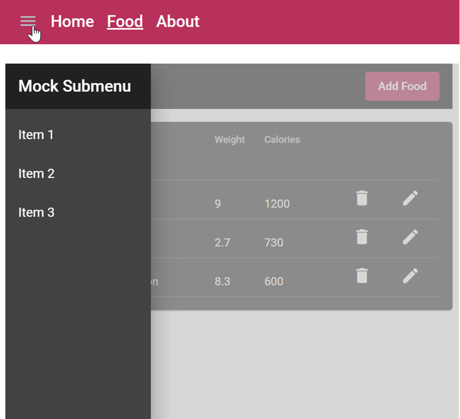

# Food App - State



## Implement a responsive Side Menu:

- Implement a menu.service.ts as a Stateful Service using BehaviorSubjects with the two properties:

    - sideNavVisible: boolean
    - sideNavPosition: over | side

- Add a Material Sidenav to app.component.html    

  ```html
  <div class="grid">
    <div class="gd-navbar">
      <app-navbar></app-navbar></div>
    <div class="gd-loading">
      <app-loading *ngIf="isLoading | async"></app-loading>
    </div>
    <div class="gd-mainrow">
      <mat-sidenav-container>
        <mat-sidenav #sidenav class="sidenav"
        [opened]="ms.sideNavVisible | async"
        [mode]="mode">
          <app-sidemenu></app-sidemenu>
        </mat-sidenav>
        <mat-sidenav-content [ngStyle]="getWorbenchStyle()">
          <router-outlet></router-outlet>
        </mat-sidenav-content>
      </mat-sidenav-container>
    </div>
  </div>
  ``` 
- Add a required css to app.component.scss

  ```css
  .grid {
    display: grid;
    height: 100vh;
    width: 100%;
    gap: 0.5rem;
    grid-template-rows: 70px 10px calc(100vh - 100px);
    grid-template-columns: auto;
    grid-template-areas:
      "navbar"
      "loading"
      "mainrow";
  }

  .gd-navbar {
    grid-area: navbar;
  }

  .gd-loading {
    grid-area: loading;
  }

  .gd-mainrow {
    grid-area: mainrow;
    background-color: lightgray;
  }

  .sidenav{
    height: 80vh;
  }
  ```

- Take the [demo.container](.../../../../demos/07-rxjs-state/ng-reactive/src/app/demos/demo-container/) and the [sidenav.service.ts](.../../../../demos/07-rxjs-state/ng-reactive/src/app/shared/sidenav/sidenav.service.ts) as a reference.

## Implement a global loading inicator (Advanced Optional):

Note: If your time permits you can also a loading indicator using an interceptor. Take this reference from the [Demo App](.../../../../demos/07-rxjs-state/ng-reactive/src/app/shared/loading/).

- Implement a stateful loading service

- Implement an [HttpInterceptor](https://angular.io/guide/http#intercepting-requests-and-responses) to toggle a loading service that is used to show a loading indicator. Keep in mind that there could be multiple request at the same time.

- Register the interceptor in the app.module.ts

  ```typescript
  providers: [
    LoadingService,
    { provide: HTTP_INTERCEPTORS, useClass: LoadingInterceptor, multi: true },
  ],
  ```