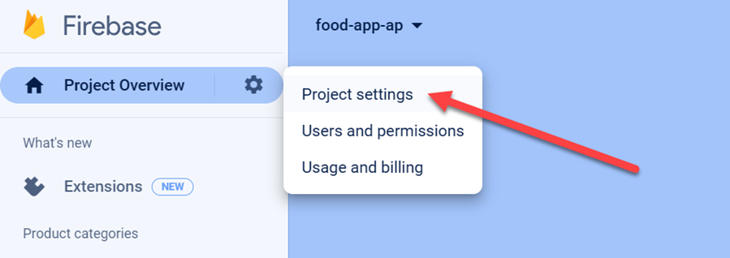
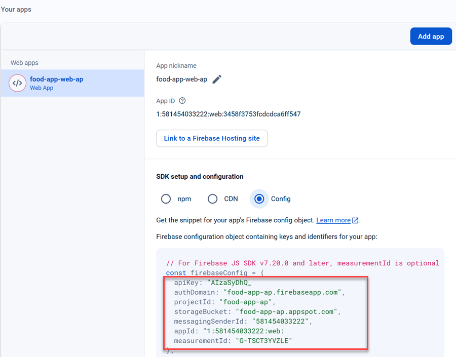

# Authentication

In this lab we will add Firebase Authentication as an example for easy to implement token based auth to our app and publish it to Firebase Hosting.

## Steps Outlined

- Register a Firebase Project
- Copy and Use the provided Firebase Authentication artifacts
- Activate Security on the `food-route`

# Register a Firebase Project

-   Got to [Firebase](https://console.firebase.google.com/) and create a new project (e.g. `food-app-<your-initials>`). Accept the default settings and press continue when prompted.

    

-   Create a web app in your project (e.g. `food-app-web-<your-initials>`). Accept the default settings and press `register app` when prompted and then `continue to console`.

    

-   Copy the app config from the Firebase console into your `environment.ts` file.

    

-   Add an `authEnabled` key with value `false` to your environment file. Also add a `firebaseConfig` and paste the config that you just copied.

-   In the Firebase console, expand `Build` and go to `Authentication` and enable `Email/Password` as a sign-in method. Skip the e-mail validation for now.

## Copy and Use the provided Firebase Authentication artifacts

-   Add the following dependencies to your project:

    ```bash
    npm install firebase @angular/fire --save
    ```

-   Copy the following [artifacts](./auth-artifacts/) to your project. You can take the following [reference](../../demos/06-security/01-firebase/firebase-auth/) implementation. Fix any import path errors that might exist.

-   Provide the firebase services in `app.config.ts`:

    ```typescript
    importProvidersFrom(
      provideFirebaseApp(() => initializeApp(environment.firebaseConfig)),
      provideAuth(() => getAuth())
    )
    ```

-   Review `firebase-auth.service.ts` and add the following to `app.component.ts`:

    ```typescript
    auth = inject(FirebaseAuthService);
    isAuthenticated = this.auth
      .isAuthenticated()
      .pipe(tap((auth) => console.log('authState changed to:', auth)));
    ```

-   Modify `app.component.html` to show the intro-component when the user is not authenticated and current content when the user is authenticated. Add a title and an image to the intro component. A possible solution could look like this:

    

    > Note: You can turn off authentication by setting `authEnabled` to `false` in your environment file.

-   Review and add `app-current-user` and the `app-logout-btn` to nav.component.html. You might have to add missing imports in the `nav.component.ts` file. The logout button should only be visible when the user is logged in.

## Activate Security on the food route

- Examine `firebase.auth-guard.service.ts` and activate the guard on the food route in `app.routes.ts`:

  ```typescript
  export const routes: Routes = [
      { path: "", component: HomeComponent },
      { path: "about", component: AboutComponent },
      {
          path: "food",
          component: FoodComponent,
          canActivate: [FirebaseAuthGuard],
      },
  ];
  ```

- Test if you can access the food route when you are not logged in. You should be redirected to the root page.

- Refactor the guard to a functional implementation on your own. A possible Solution could look like this:

  ```typescript
  export const firebaseGuard = () => {
    const router = inject(Router);
    const auth = inject(FirebaseAuthService);
    const user = auth.getUser();
    return user.pipe(
      map((user) => {
        if (environment.authEnabled == false || user != null) {
          return true;
        } else {
          router.navigate(['/']);
          return false;
        }
      })
    );
  }
  ```

  > Note: If you would like to forward the token to the backend, you can use `firebase-auth.interceptor.ts` as a reference and register the interceptor in `app.config.ts`:

  ```typescript
  provideHttpClient(
      withInterceptors(firebaseAuthInterceptor)
    ),
  ```